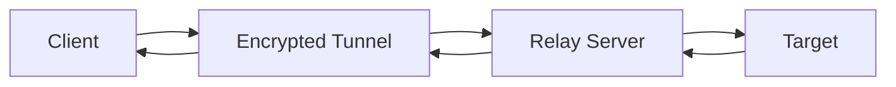

<p align="center">
  
</p>

<p align="center">
  
</p>

<p align="center">
  
  
  
  
  
  
</p>

---

## 🔥 Overview

**Link-Relay** is a minimalist encrypted relay server designed for secure point-to-point communication channels. Originally built for covert C2 (Command & Control) operations, it provides a lightweight, low-latency tunnel between clients and targets through an encrypted relay layer.

```
┌─────────────────────────────────────────────────────────────────┐
│                                                                 │
│   ┌────────┐     ┌──────────────────┐     ┌──────────────┐     │
│   │ Client │◄───►│ Encrypted Tunnel │◄───►│ Relay Server │◄───►│
│   └────────┘     └──────────────────┘     └──────────────┘     │
│                                                      │          │
│                                                      ▼          │
│                                              ┌──────────────┐   │
│                                              │    Target    │   │
│                                              └──────────────┘   │
│                                                                 │
└─────────────────────────────────────────────────────────────────┘
```

### Architecture Flow



---

## ⚡ Quick Start

```bash
# Clone the repository
git clone https://github.com/Ruby570bocadito/Link-Relay.git
cd Link-Relay

# Install dependencies
# (adjust based on your implementation - Python/Go/Node)
pip install -r requirements.txt
# or
go mod download
# or
npm install

# Start the relay server
python relay_server.py --port 8080 --key ./server.key

# Connect a client
python client.py --relay localhost:8080 --target example.com:443
```

---

## 📡 API Endpoints

| Method | Endpoint | Description | Auth |
|--------|----------|-------------|------|
| `POST` | `/relay/connect` | Establish encrypted relay session | Token |
| `POST` | `/relay/send` | Send encrypted payload through relay | Session |
| `GET` | `/relay/poll` | Poll for incoming messages | Session |
| `POST` | `/relay/disconnect` | Terminate relay session | Session |
| `GET` | `/health` | Server health check | None |
| `GET` | `/status` | Relay server status & metrics | None |

---

## 🛡️ Security

- **End-to-end encryption** — payloads are encrypted client-side and only decrypted at the target
- **No persistent logging** — relay server never stores messages to disk
- **Session isolation** — each relay session is cryptographically isolated
- **Forward secrecy** — ephemeral key exchange per session

---

## 📦 Configuration

| Variable | Default | Description |
|----------|---------|-------------|
| `LISTEN_PORT` | `8080` | Relay server listen port |
| `TLS_CERT` | — | Path to TLS certificate |
| `TLS_KEY` | — | Path to TLS key |
| `MAX_SESSION_TTL` | `3600s` | Maximum session lifetime |
| `RATE_LIMIT` | `100/s` | Incoming request rate limit |

---

## 📄 License

Distributed under the MIT License. See `LICENSE` for more information.

---

<p align="center">
  <b>Link-Relay</b> — <i>Minimalist Encrypted Relay Server</i><br>
  Built with 🔥 by <a href="https://github.com/Ruby570bocadito">Ruby570bocadito</a>
</p>

<p align="center">
  
</p>
